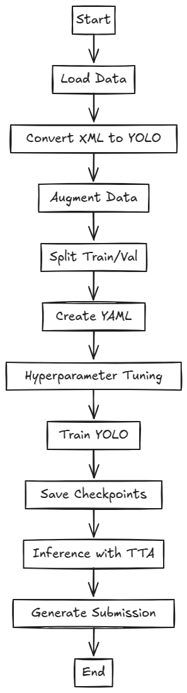

# YOLOv11 Object Detection Pipeline

This repository contains a Jupyter Notebook for training and evaluating a YOLOv8 object detection model on a custom dataset.

## Table of Contents
- [YOLOv11 Object Detection Pipeline](#yolov11-object-detection-pipeline)
  - [Table of Contents](#table-of-contents)
  - [Overview](#overview)
  - [Dataset Processing](#dataset-processing)
  - [Model Training](#model-training)
  - [Inference and Evaluation](#inference-and-evaluation)
  - [Implementation Strategy](#implementation-strategy)
  - [Implementation Strategy](#implementation-strategy-1)
  - [Results](#results)
  - [Usage](#usage)

## Overview
This project aims to train a YOLOv11 model using a custom dataset of images and XML annotations. The pipeline includes data preprocessing, augmentation, training, and inference.

## Dataset Processing
- Convert XML annotations to YOLO format.
- Apply data augmentation to improve model robustness.
- Split the dataset into training and validation sets.
- Generate a `dataset.yaml` file for YOLO training.

## Model Training
- Define hyperparameters and configure training settings.
- Train the model using YOLOv8 with hyperparameter tuning.
- Save checkpoints and analyze performance.

## Inference and Evaluation
- Perform inference using Test-Time Augmentation (TTA).
- Evaluate model predictions and generate a submission file.

## Implementation Strategy
The following diagram outlines the strategy used to implement the pipeline:

## Implementation Strategy
The following diagram outlines the strategy used to implement the pipeline:

  

## Results
- Model achieved **80% mAP50-90** on validation set.
- Predictions were refined using TTA for improved accuracy.

## Usage
- Create a new notebook inside the Pulmonary Nodule Detection competition 
- Copy the notebook from this repository
- Paste it inside the notebook on kaggle 